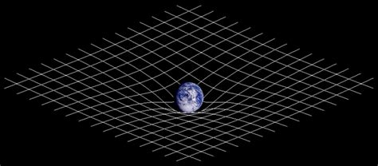

+++
title = "Albert Einstein"
date = "2021-03-09"
draft = false
pinned = false
image = "865px-einstein_1921_portrait2-2-.jpg"
footnotes = "*"
+++

Albert Einstein wurde am 14. März 1879 in Ulm geboren. Seine Eltern (Hermann Einstein und Pauline Einstein) zogen aber kurz nach seiner Geburt mit ihm nach München. Dort wurde dann 1881 Alberts jüngere Schwester Maja geboren. 1884 zog die Familie nochmals um nach Mailand. Einstein sollte aber bis zum Abitur am Luitpold Gymnasium bleiben, verliess aber die Schule ohne Abschluss. 1894 und folgte seiner Familie nach Mailand. Einstein bewarb sich mit 15 Jahren an der eidgenössisch polytechnischen Schule Zürich. Da er noch kein Abitur hatte, musste Einstein an den Aufnahmeprüfungen teilnehmen. Die er jedoch nicht bestand, ging er dann an die aargauische Kantonsschule, um dort seine Matura nachzuholen. In Einsteins Zeugnis, 1896, der Maturitätsprüfung stand 5-mal eine 6 und eine 3 in Französisch. Das Gerücht, dass Einstein allgemein ein schlechter Schüler war, ist falsch. Es geht auf seinen ersten Biografen zurück, der die Schweizer Schulnoten mit den deutschen verwechselte.

Einstein bestand 1900 mit einem Diplom als Fachlehrer in mathematischer Richtung. Von der eidgenössisch polytechnischen Schule Zürich. Er hatte es nicht einfach Arbeit zu finden, fand aber schliesslich Arbeit als Patent-Angestellter in Bern, 1902. Was darauf folgte wird als Einsteins Wunderjahre bezeichnet. Er schrieb 4 unglaublich wichtige Theorien. Inklusive der berühmtesten Formel der Welt: E = mc². Was die Formel sagt ist, dass Energie = Masse ⋅ (mal) Lichtgeschwindigkeit im Quadrat. Also wissen wir jetzt, dass alle Masse aus einer unbegreifbar riesigen Quantität Energie besteht. Einstein musste nur einen Weg finden, diese Energie freizusetzen und hier gibt es 2 Wege wie Masse Energie freigibt. Fusion oder Fission. Fission ist, wenn grosse und schwere Atome auseinanderbrechen. Beide Wege lassen überwältigende Quantitäten an Energie frei. Nehmen wir mal ein Beispiel: die erste Atombombe, die jemals gezündet wurde, explodierte, indem sie 860 mg Uranium fissionierte
zur Visualisierung so viel ist, 860 mg.

Diese kleine Quantität an Uran war genug um 140,000 Menschen zu töten. Die Theorien wurden an der Universität Zürich veröffentlicht und man berief Einstein 1909 zum Professor. 10 Jahre später veröffentlichte er seine Relativitätstheorie (die weiter unten erklärt wird) die aber nur 1921 bewiesen wurde. Im gleichen Jahr wurde er mit dem Nobelpreis für Physik ausgezeichnet. Einstein starb 1955 im Alter von 72.

Meiner Meinung nach schreibe ich jetzt über eines der spannendsten Themen in der Geschichte der Menschheit. Die Relativitätstheorie ist das grösste Werk von Einstein, das ihn bis zum heutigen Tag berühmt machte. Die Theorie ist nicht sehr schwierig zu verstehen aber schwierig zu akzeptieren. Weil es gegen unsere praktische Erfahrung geht. Die Theorie besteht grob aus 5 Teilen, dies hier ist eine sehr vereinfachte Version.

Teil 1: Klassische Relativität
Klassische Relativität sagt, dass es keine absolute Bewegung oder Stillstand gibt. Objekte bewegen sich relativ zueinander und die Bewegung ändert sich je nach Perspektive z. B. wenn ich ein Auto hier auf der Erde sehe, fährt das Auto von meiner Perspektive 40 km/h. Von Ost nach West aber von einer anderen Perspektive fährt das Auto 1,670.2 km/h, weil sich die Erde mitbewegt.

Teil 2:
Wir müssen akzeptieren, dass Licht die gleiche Geschwindigkeit hat für alle Beobachter. Es ist konstant 299 792 458 m/s. Einstein wusste damals, dass die beiden Theorien (die 3 Bewegungsgesetze von Isaac Newton und die Gesetze des Elektromagnetismus von James Clerk Maxwell) gegeneinander gingen, und kam zum Schluss, dass eine der beiden Theorien falsch sein musste. Doch Einstein fand einen Weg so, dass beide Theorien der Wahrheit
entsprachen mit nur einer kleinen Veränderung in Newtons Gesetze. Er nannte es Zeitdilatation es bedeutet das Licht Zeit biegt, so dass es immer gleich für alle Beobachter bleiben kann und hier fand Einstein heraus das Zeit relativ war.

Teil 3: Zeitreisen
Die Zeit verlangsamt sich für Objekte, die sich in der Nähe der Lichtgeschwindigkeit bewegen. Und für die Masse, die sich mit Lichtgeschwindigkeit bewegt stoppt die Zeit komplett. Dies passiert nicht mit Licht, weil Licht keine Masse hat es ist eine Partikel mit einer Welle. Und wenn wir darauffolgen, ist es logisch, dass für Masse, die sich schneller als Lichtgeschwindigkeit bewegt die Zeit sich zurückdreht. Leider würde Masse auf Lichtgeschwindigkeit zu bringen unendlich viel Energie benötigen und ist somit aus unserer Reichweite.

Teil 4: Schwerkraft
Einstein erklärte in seiner Theorie, dass es wir in einem 4-dimensionalen Universum leben. Die 3 Raum Dimensionen und Zeit. Aber Einstein dachte den Raum und Zeit zur selben Dimension gehörten, er nannte sie Raumzeit. Und er sagte, dass Masse Raumzeit krümmte desto mehr Masse desto grössere Krümmung. Dies verursacht die Anziehungskraft, die wir täglich spüren.

Teil 5:
Wie wissen wir, dass so eine absurde Theorie der Wahrheit entspricht. Im Verlaufe der Zeit sind zahllose Experimente durchgeführt worden, um zu beweisen das diese Theorie wahr ist. Aber ich zeige euch ein kleines Beispiel: 1971 wurde das Hafele–Keating Experiment durchgeführt. Für das Experiment wurden 4 supergenaue Atomuhren auf Flugzeuge geladen und flogen 2-mal um die Welt einmal nach Westen und einmal nach Osten. Als die Uhren wieder in USA ankamen warnen die Uhren nicht mehr synchronisiert. Und die Zeitangaben
stammen überein mit der Berechnung von der Theorie Einsteins. 

Danke für das Lesen