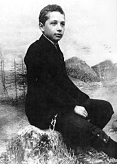
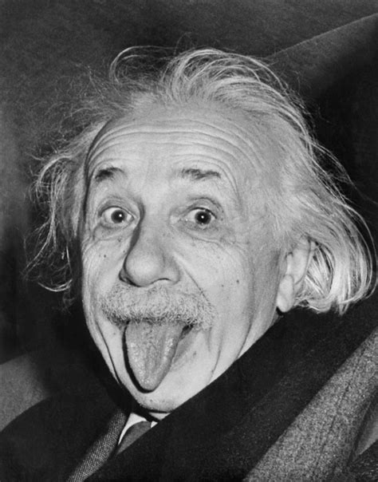
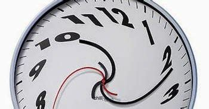

+++
title = "Albert Einstein"
date = "2021-03-09"
draft = true
pinned = false
image = "https://cdn.britannica.com/59/23359-131-42CFFC3D/Albert-Einstein.jpg"
+++

Albert Einsein wurde am 14. März 1879 in Ulm geboren seine Eltern (Hermann Einstein und Pauline Einstein)zogen aber kurz nach seiner geburt mit ihm nach münchen dort wurde dann 1881 albers jüngere schwester maja geboren.  1884 zog die familie nochmals um nach Mailand einstein sollte aber bis zum Abitur am Luitpold-Gymnasium bleiben verlies aber die schule onhe abschlus 1894 und volgte siene familie nach mailand einstein bewarb sich mit 15 jahren an die eidgenössisch polytechnischen schule zürich da er noch keine abitur hatte muste einstein an den afnamprüfungen teilnemen die er jedeoch nicht bestand er ging dan an die aargauischen Kantonsschule um dort seine matura nachzuholen in einsteins zeugnis  1896 der maturitätsprüfung stand 5 mal eine 6 und eine 3 in französisch das grücht das einstein allgemein ein schlechter schüler war ist falsch es geht auf seinen ersten biografen zurük der die schweizer schulnoten mit den deutschen verwechselte 

Einstein bestand 1900 mit einem Diplom als Fachlehrer in mathematischer Richtung von der eidgenössisch polytechnischen schule zürich er hatte es nicht einfach arbeit zu finden fand aber schlieslich arbeit als Patentangestellter in Bern 1902 was darauf folgte wird als einsteins wunderjahre bezeichnet er schrieb  4 unglaublich wichtige theorien inklusiev die berümteste vormel der welt E = mc²  was die vormel sagt ist das Energie = Masse ⋅ (mal) lichtgeschwindikeit im quadrat also wissen wir jetzt das alle masse aus unbegreifbar riesigen quantitäten energie bestet einstein muste nur ein weg finden diese energie freizusetzen und hier gibt es 2 wege wie masse energie freigibt fusion oder Fission Fission ist wenn grosse und schwere atome auseinanderbrechen beide wege lassen uberwaltige quantitäten an energie frei nehmen wir mal ein beispiel die erste atom bombe die jemals gezündet wurde explodierte indem sie 860 mg uranium Fissionierte zur visualisierung so viel ist 860 mg 

diese kleine quantität an uranium war genug um 140,000 meschen zu töten die theorien wurden  an der Universität Zürich und man berief einstein 1909 zum profesor 10 jahre später veröfentlichte er seine relativitäts theorie (die weiter unten erklärt wird) die aber nur 1921 bewiesen wurde im gleichen jahr wurde er mit dem Nobelpreis für phisik ausgezeichnet einstein starb 1955 im alter von 72 

meiner meinung nach schreibe ich jetzt über einer der spanndensten tema in der geschichte der menschheit die relativitäts theorie es ist das gröste werk von einstein das ihn bis zum heutigen tag berümt machte die relativitäts theorie ist nicht sehr schwierig zu ferstehen aber schwierig zu akzeptieren weil es gegen unsere praktische erfarung geht die theorie bestet aus grob 5 teile dies wird eine sehr fereinfachte version 

Teil 1 klasische relativität, klasische relativität  ist das es keine absulte bewegung oder stilstand gibt obiekte bewegen sich reliativ zu einander und die bewegung ändert sich je nach perspektive zb: wan ich ein auto hier auf der erde sehe fährt das auto von meiner perspektive 40 kmh von ost nach west aber von einer anderen perspektive färt das auto 1,670.2 kmh weil sich die erde mitbewegt.

Teil 2 wir müssen akzeptieren das licht die gleiche geschwindikeit hat für alle beobachter es ist konstant            299 792 458 m/s einstein wusste damals das die beide theorien (die 3 Bewegungsgesetze von isaac newton und die Gesetze des Elektromagnetismus von James Clerk Maxwell ) gegeinander gingen und kam zum schlus das eine der beiden theorien falsch sein muste doch einstein fand ein weg so das beide theorien der warheit entsprachen mit nur einer kleiner veränderung in newtons gestze er nante es Zeitdilatation es bedeuted das licht zeit biegt so das es immer gleich für alle beobechter bleiben kann und hier fand einstein heraus das zeit relativ war

Teil 3 Zeitreisen Die Zeit verlangsamt sich für Objekte, die sich in der Nähe der Lichtgeschwindigkeit bewegen und für masse mit lichtgeschwidikeit bewegt stopt die zeit komplet dies pasiert nicht mit licht weil licht keine masse hat es ist eine partilel mit einer welle und wenn wir darauf folgen ist es logisch das für masse die schneller als lichteschwindiekeit reist die zeit sich zurük dreht leider würde masse auf lichtgeschwinikeit zu bringen würde unenlich viel energie benötigen und ist somit aus unserer reichweite