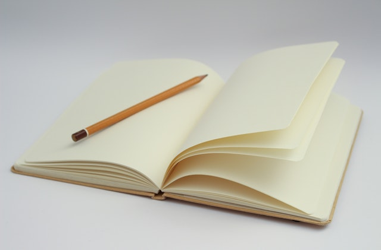

+++
title = "Anfang und Ende "
date = "2022-01-25"
draft = true
pinned = false
+++
Diesen Sommer werde ich meine Lehre als Bibliothekar Beginnen dies ist der Anfang von etwas. Aber das markiert auch das ende von etwas anderem. Meine zeit als Homeschooler neigt sich dem ende zu es war eine zeit die ich sehr wertschätzte und niemals vergessen werde. Als ich mich entschied Homeschooler zu werden gab es nicht wenige Leute die mir sagten das dies ein weg ohne Zukunft wäre und das ich mein Platzt in der Welt nicht finden würde falls ich ihn betrat. Trotzdem habe ich meine Entscheidung ungetrübt von all dem getroffen. oftmals war ich auch selber unsicher auf diesem Pfad den ich beschritt aber ich hatte immer Leute an meiner Seite die mir aufhalfen und Sicherheit gaben. am ende bin ich sehr froh das ich mich damals für das Homeschooling entschieden habe und mich zum Menschen entwickelt den ich heute bin. 

Jetzt habe ich zeit meine letzten Projekte und wünsche zu erfüllen. und für dieses Halbjahr habe ich mir 3 ziele gesetzt. Erstens will ich mich mit webdesign besser vertraut machen so das ich eine vollständige Website Programmieren kann zweitens Möchte ich mich vorbereiten auf die Berufsschule so das ich mit einem Vorsprung Beginen kann und mein drittes Projekt ist ein Stoff Sitzsack denn ich selber nähen werde. ich kann es kaum erwarten dieser neue abschnitt von meinem leben zu Beginen.