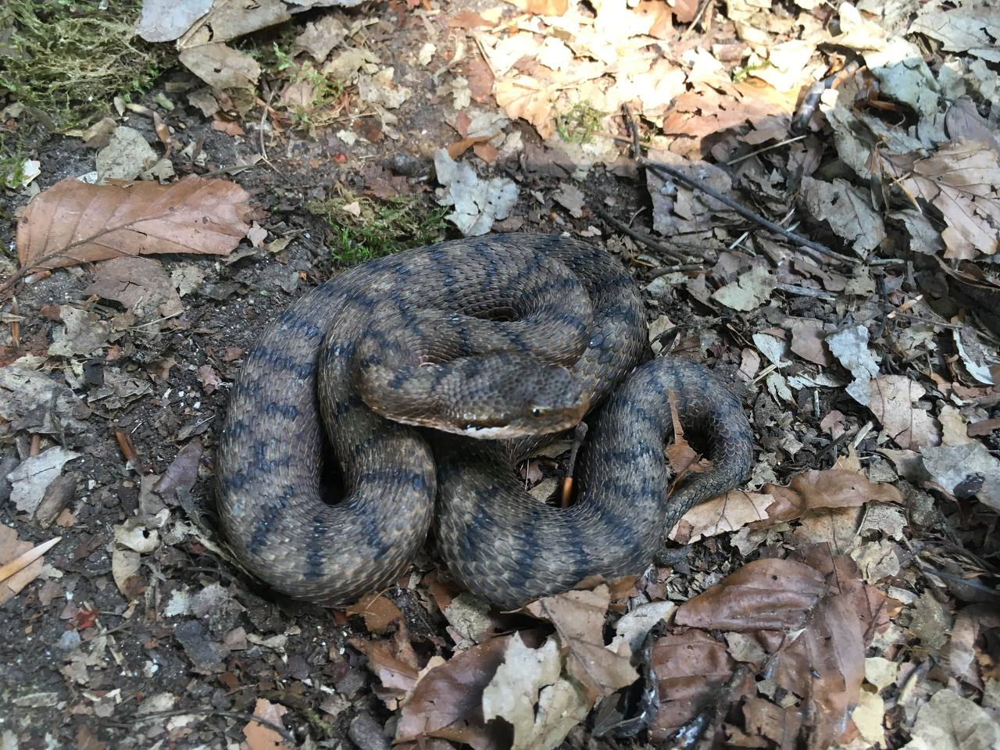

+++
title = "Ausflug nach Twann "
date = "2022-05-31"
draft = true
pinned = false
image = "twann_am_bielersee_mit_petersinsel.jpg"
+++
Gestern war ich mit meiner Homeschuling Gruppe FLW in Twann. Twann ist ein Kleines Dorf am Bielersee das Grossteils von Weintrauben bewohnt wird. Da es an der Sonnenseite des Sees liegt ist es immer schön warm was Optimal für die wein Produktion ist. Aber wir hatten Interesse an ganz anderen Lebewesen die die sonne Geniessen gewidmet. Schlangen!! Twann ist ein super Lebens Ort für schlangen da es sehr viele trocken mauern  gibt in denen sie sich aufwärmen können ohne ihren Schutz zu verlassen. das Ist ein sehr grosser Vorteil für viele Reptilien. am ende haben wir 4 Schlangen gesehen und sind im Bielersee baden gegangen 

