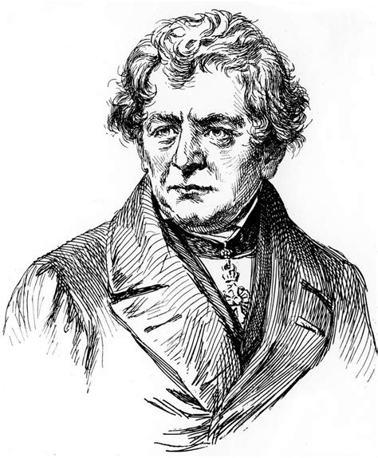
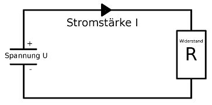
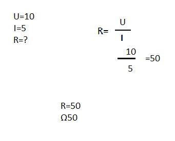

+++
title = "das Ohmsches Gesetz"
date = "2020-11-18"
draft = true
pinned = false
image = "download.jpg"
+++

Das ohmsche Gesetz besagt: Die Stärke des durch ein Objekt fliessenden elektrischen Stroms ist proportional der elektrischen Spannung. Also ganz einfach der Strom fliest weniger schnell wen er auf widerstand trift. Dazu gibt es auch eine Formel 

Mit dieser Formel kann man R berechnen. R besagt den widerstand U sind die Volt also Elektrische Spannung und I ist Ampere die menge an Elektronen. Wen ich Ampere mal Volt mache dann gibt das den widerstand 

Du Musst U=Volt ⋅(mal) I=Amphere das gibt R=den widerstand welcher in omega gemsen wird hier beim beispiel ist U=10 und I=5 was uns ein wiederstand von 50 gibt 

Georg Simon Ohm kam aus einer alter Bürger Familie in Deutschland sein Vater¨Johann Wolfgang Heiratete seine Mutter Elisabeth Maria Beck 1785. George Ohm hatte ein Bruder Martin Ohm. Georgs Vater studierte schon Mathematik und schichte seine Kinder schon in jungem alter ins Gymnasium seine Lehrer waren so beeindruckt das sie in mit 16 ein Studium in Mathematik Philosophie und Physik an der Friedrich-Alexander-Universität Erlangen. wegen finanziellen gründen musste er das Studium frühzeitig abrechnen und ging in die Schweiz unterrichten Er kam zurück und beendete sein Studium und ging nach Berlin in Erfand er dann das Ohmische gesetzt er starb am 6. Juli 1854 in München