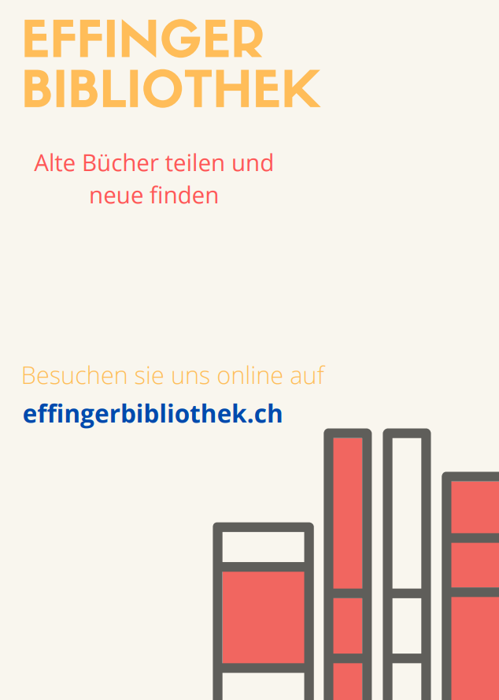

+++
title = "Der Anfang"
date = "2021-06-10"
draft = false
pinned = false
tags = ["EffingerBibliothek"]
image = "pexels-photo-5417630-2-.jpeg"
+++
Ich bin am Anfang meines Projektes und finde jetzt mehr Motivation in mir. Man kann jetzt miterleben wie die "Effinger Bibliothek" Form annimmt. Und was sie in der Zukunft definieren wird. Ich habe den ersten Flyer-Prototyp entworfen. Ich mag es den nächsten Schritt zu machen und der wäre, die Website zu gestalten. Im Moment ist sie noch ziemlich kahl. Ich bin mir noch nicht sicher, ob ich das gleiche Design wie bei den Flyern verwenden will. Oder etwas neues.

Denn der Flyer ist sehr simpel mit nur 2 Grundfarben. An einem Flyer sieht das toll aus, aber die Website braucht was anderes. Grössere Flächen sehen mit mehr Detail besser aus, das Gegenteil für kleine Flächen. Bald wird die Bibliothek "offiziell" gestartet. Ich kann kaum warten.