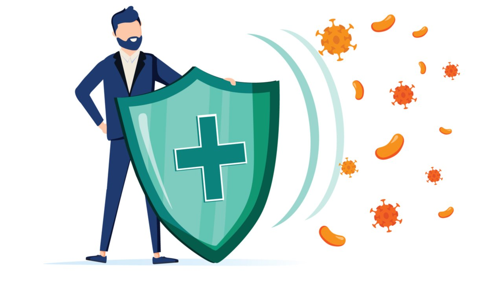

+++
title = "Immunsystem"
date = "2021-09-02"
draft = true
pinned = false
tags = ["Biologie"]
+++
das menschliche immun System ist das komplexeste Biologische System das wir kennen mit Ausnahme von unserem Gehirn. Das Immun System besteht aus Hunderte von kleinen Organe die Lymphknoten und 2 Grosse. Die Thymusdrüse  und die Milz. Es hat auch ein eigenes Transport System das sich Lymphgefäss nennt. Diese Organe produzieren Milliarden von Zellen Jeden Tag die organisiert sind wie eine arme. Mit Soldaten, Capitaine, Geheimdienst und Artillerie. Sie haben alle Mehrere Aufgaben aber ein gemeinsames ziel. Dein Körper zu beschützen.

- - -

Stellen wir uns vor dein immun System kommt zum Einsatz gegen eine kleine Schnittwunde. Deine Haut die erste Verteidigungslinie von deinem Körper ist gefallen und Millionen von Bakterien stürmen herein. Die erste Reaktion von deinen Zellen ist ein allarmschrei, alle überlebenden Zellen setzten Chemikalien frei um das immun System zu allarmieren. Die erste Verteidigung die ankommen sind Makrophagen. Wenn eine Zelle so gross wär wie ein Mensch dann wäre eine Makrophage so gross wie ein Schwarzes Rhino. Sie Verschlucken die Bakterien ganz und Verdauen sie. nachdem die Makrophagen ihren angriff beendet haben rufen sie Verstärkung. Die Neutrophile kommen jetzt aufs Schlachtfeld, Neutrophile sind Suizid Soldaten die in der Schlacht ihr leben lassen