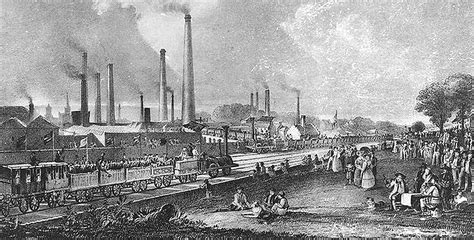
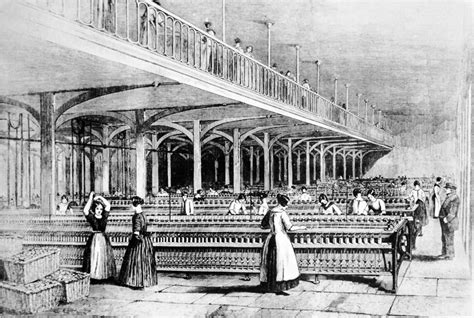
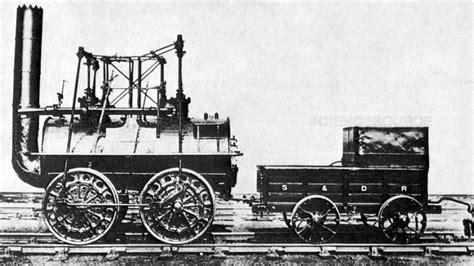
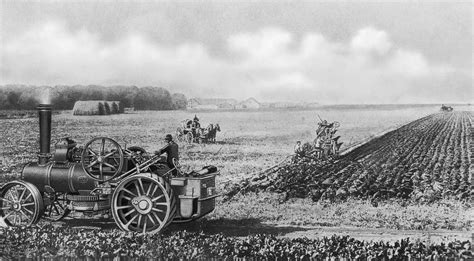
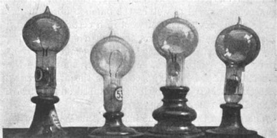
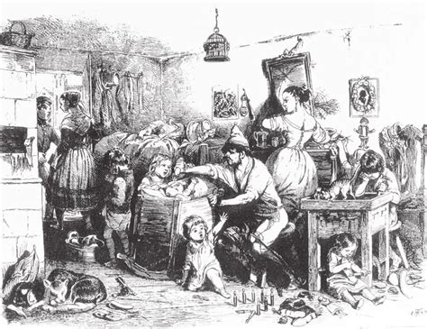
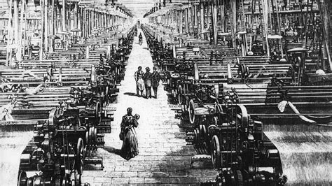

+++
title = "Industrielle Revolution"
date = "2020-11-24"
draft = true
pinned = false
image = "download.jpg"
+++

Niemand weiss genau, was der Auslöser für die Industrielle Revolution war. Aber man weiss wann sie begann. 1760 in Grossbritannien fing die Industrielle Revolution mit erhöhter Kohlenproduktion an. James Watt erfand die Dampfmaschine um das viele Wasser aus den Minen zu pumpen, die oft überflutet wurden. Die Technologie, die in unserer Welt bis heute benutzt wird, nämlich in Atom- und Kohlenkraftwerken es ist nämlich alles nur Wasser in Dampf umwandeln.

Die Dampfmaschine öffnete eine Türe ganz neuer Möglichkeiten: Massenproduktion von Eisen, Kleider, Essen. Immer mehr Leute kamen in die Städte, was immer mehr Produktion bedeutete. Am Anfang der Revolution lebte weniger als 15% Prozent der Population in Städten, dann wurden es 50% und am Ende 85%. Die Revolution änderte auch die textilie Produktion. Als die Revolution begann dominierte Indien den Markt. Doch England erfand die Spinnmaschine, die weniger Personal brauchte und schneller produzierte und übernahm so den Markt.

Eine grosse Veränderung war auch die Eisenbahn. Sie transportierte Güter und Menschen durchs Land, was der Industrie viel Geld sparte. Aber nicht alle waren einverstanden mit dieser Erfindung. Die Bauer fürchteten, dass die Funken die von der Eisenbahn kamen das Land in Brand setzen würde. Und die Ärzte sagten, die grosse Geschwindigkeit wäre gesundheitsschädigend. (Das waren knapp 30 kmh)

Doch was der Revolution einen richtigen Schub gegeben hat, war die Landwirtschaftliche Revolution. Die Tiere wurden durch Maschinen ausgetauscht und man benutzte neue Methoden wie zum Beispiel Dünger. Das brachte mehr Essen und die Population erhörte sich dramatisch. Mehr Leute brauchten mehr Arbeit, mehr Arbeit gab es in den Minen. Das wiederum brachte mehr Kohle. Mehr Kohle gab Platz für neue Fabriken, da der Treibstoff für Maschinen günstiger wurde Und das gab mehr Arbeit. Das Rad dreht sich weiter und weiter.

Die berühmte Glühbirne wurde ebenfalls in der Industrialisierung erfunden, doch zu erst beherrschte die Gas Beleuchtung den Markt es war nämlich viel günstiger. Eine Glühbirne brannte zur zeit nur 48 stunden also wurden alle Grosstäte mit Gas beleuchtet. Erst 1854 wurde die erste gebräuchliche Glühbirne gebracht. Es gibt immer noch viel Spekulation wer die Glühbirne erfunden hat, doch sie beleuchtet unsere Welt noch bis heute.

Doch für die Population war das Leben schwer man wurde wenig bezahlt. Man musste länger und härter arbeiten und auch schon die Kinder ab 6 Jahren, in den Fabriken. Überfüllte Strassen und Häuser. Krankheit und Armut. In diesem Zeitalter wuchs der Unterschied zwischen Arm und Reich wie nie zuvor. Viele Leute in England waren zur zeit Anhänger einer Religion namens Calvinistische Religion. (Die eigentlich teil von der Katholischen Religion ist aber das ist ein anderes Thema) Die Calvinistische Religion Folgt den lehren von Jean Calvin, die besagen das arbeiten und Geld anstreben eine gute und sogar schuldbefreiende Sache ist.

Zusammengefasst ist die Industriele Revolution unser wandel als Spezies von der Agrargesellschaft zur Industriesegellschaft. Die Industrialisierung brachte noch viele andere tolle Sachen die ich hier nicht rein-getan habe. Es ist ein unglaubliches Phänomen und sicher nicht die letzte Evolution Phase die Menschheit gesehen hat.

Danke Für das lesen