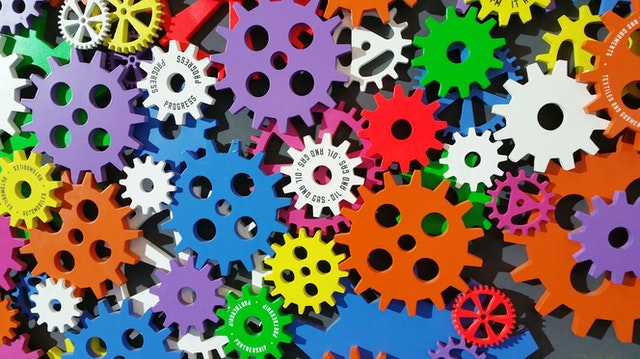

+++
title = "Intelligenz "
date = "2021-10-21"
draft = true
pinned = false
tags = ["Biologie"]
image = "aaa4101-1-1-.jpg"
+++
Wir Menschen Haben schon ziemlich viel vollbracht von Raketen zu Minecraft und all das dank einer einzigartigen Fähigkeit die wir besitzen. Unsere Intelligenz aber was ist Intelligenz?  Wir stellen uns Intelligenz vor wie Höhe oder Stärke aber es ist nicht ganz so einfach zum definieren. Intelligenz ist ein flexibler Werkzeugkasten. Die Grundlagen unserer Intelligenz sind die Fähigkeit Information zu sammeln zu speichern und zu gebrauchen um zu Lernen. Information über die Umwelt und sich selbst ist das Fundamentalste aller Werkzeuge. Die Fähigkeit sich zu erinnern Erweitert den Horizont und bietet die Möglichkeit etwas zu lernen. Was wir Lernen nennen ist das zusammenführen von Individuellen Aktionen. und sie zu wiederholen bis sie gemeistert ist. Das sind die  Basiswerkzeuge von unserem Gehirn fast jedes Lebewesen Besitzt diese Fähigkeiten sogar Physarum polycephalum ein Schleim-Pilz Zeigt ähnliches verhalten wie ein Kleintier

Unser Gehirn kann sich unzählige mechanische Abläufe Merken und hervorrufen falls nötig. Diese Fähigkeit nennen wir mal unsere Wissens Bibliothek. jetzt hat kommt ein spannendes Werkzeug das alle vorherigen verbinden kann nämlich Kreativität. Kreativität verleiht uns die Fähigkeit Zwei unverwandte Dinge zu verbinden. Das Bedeutet das man neue und ungewohnte Lösungen für ein spezifisches Problem findet. noch eine nützliche Fähigkeit die mit Kreativität kommt ist Physische Werkzeuge zu benutzten wie zum Beispiel Affen die Stöcke benutzten um an Essen zu kommen oder gewisse Oktopusse die lehre Kokosnüsse als versteck verwenden.

eine Komplexe Fähigkeit von uns ist Planen das ist die Fähigkeit verschiedene Aktionen verbinden um ein Ziel in der Zukunft zu erreichen das beste Beispiel von dem sind die Eichhörnchen sie können es vergraben um es an einen späteren Zeitpunkt essen. eine Kuh kann das nicht aber muss sie auch nicht können Die Fähigkeiten die für eine Kuh wichtig sind sind social. die Tiere in unserem Umfeld haben sich genau das aneignet was für ihr überleben wichtig ist