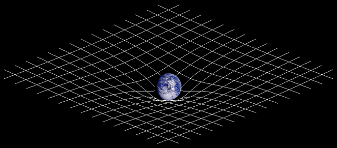

+++
title = "Isac newton"
date = "2020-12-10"
draft = true
pinned = false
image = "isac-.jpg"
+++

Isaac Newton wuchs in einem armen Bauernhaus auf sein Vater mit gleichem Namen starb 3 Monate vor seiner Geburt. Seine Mutter heiratete zum zweiten mal 1646 und zog zu ihrem ehe-man lies Newton aber bei seiner Grossmutter Margery Ayscough. nach dem tot seines Stiefvaters kam seine Mutter zurück mit 3 Kinder die Halbgeschwister von Isaac Newton waren. Newton arbeitete sein leben durch die schule indem er die tische und zimmer von reicheren Studenten putzte er ging dann an die Universität von Cambridge. während dem Ausbruch der Pest 1665 wurde Cambridge geschlossen und Newton musste nach hause

Zuhause begann er seine Theorie über Planetenbewegung und Licht. 1671 Veröffentlichte er sein reflektierendes Teleskop der königlichen Gesellschaft mit seiner Recherche über Farbe und licht. Kurz danach bekam er ein Besuch von Edmund Halley ein Mitglied der königlichen Gesellschaft den ihn dazu motivierte seine Theorie der Planetenbewegung zu beweisen Darauf hin schrieb Newton seine Principia drei bewegungs- Gesetze und die Idee von Schwerkraft. seine Arbeit machte hin sehr Beliebt und er wurde zum Parlament gewählt. nach ein paar Jahren in London erlitt er ein nerfenzusamenbruch. nach dem tot von Robert Hocke in 1703 wurde Newton Präsident der königlichen Gesellschaft er verbrachte seine letzten Jahren als ein reicher und berühmter man

Newton war der erste Wissenschaftler der die Schwerkraft Erklären und beweisen konnte. somit stehlen wir uns die frage, was ist Schwerkraft? Die Schwerkraft ist eine Bewegung oder Beschleunigung von Objekte die auf der Krümmung des Raumzeit zurück zu führen ist. um Schwerkraft zu verstehen muss man noch drei Sachen unterscheiden. Masse, Gewicht, Gewichtskraft starten wir doch mit Masse. Masse ist absolut das bedeutet ob auf der erde auf dem Mond oder im Weltall Masse ist immer gleich. Gewichtskraft ist das Gegenteil sie ist die kraft die Schwerkraft auf dich ausübt und sie ist relativ auf dem Mond ist also die Gewichtskraft etwa ⅙ so stark wie auf erde aber was ist dann Gewicht? obwohl Masse in kg gemessen wird hat das Gewicht nichts damit zu tun es ist nicht einmal ein physikalischer begriff. Gewicht ist nur ein mass das wir Menschen uns angeeignet haben ob zu wissen ob wir abnehmen müssen

die zwei grössten Entdeckungen von Newton war die Formel für Schwerkraft und die 3 Bewegungsgesetze. sie werden beide bis heute noch heute benutzt und sie haben unser verstehen von Physik komplett verändert. die 3 Bewegungsgesetze erklären wie sich ein Objekt bewegt

1: ein Objekt in Bewegung bleibt in Bewegung ein Objekt in Ruhe bleibt in ruhe ausser beeinflusst von aussen

2: kraft = Masse x Beschleunigung

3.Für jede Handlung gibt es eine gleiche und entgegengesetzte Reaktion

Die ersten zwei sind ziemlich einfach zu begreifen aber die dritte braucht eine kleine Erklärung. Was das 3 Gesetz sagt ist das wen du eine kraft auf ein Objekt ausübst übt das Objekt die gleiche kraft auf dich aus

die Formel der Schwerkraft war unglaublich revolutionär für das zeit alter bevor Newton eine Theorie aufstellte hatten Wissenschaftler keine anhung von Schwerkraft die legende besagt das Newton im Garten vom Haus seiner Mutter unter dem Apfelbaum sass als im ein Apfel auf dem Kopf viel und da dachte er "was wenn der Apfel nicht zur erde fällt sondern sie beide gegen einander fallen" es war der Grundbaustein für modernes verstehen von Schwerkraft und dann merkte er das es nicht nur Äpfel betrifft sonder jedes Objekt wie Planeten und Sterne

das ist die Formel für Schwerkraft die Newton erfunden hat "F" steht für die kraft also die Schwerkraft also F = G M m ÷ r das erste und zweite m stehen für die Masse der beiden Objekte und r ist die Distanz zwischen den beiden Objekten im Quadrat und hier wird es spannend denn G bedeutet das Gravitationskonstante nämlich 00000000000667408 oder dises Bild dort unten ist die Verkürzung des Gravitationskonstante

dann wissen wir jetzt das man die Schwerkraft zwischen zwei Objekte berechnen kann indem man beide massen durch die Distanz zwischen ihnen im Quadrat mal 00000000000667408 rechnet das. war das leben von Isaac Newton und seine Entdeckungen.

Danke fürs lesen