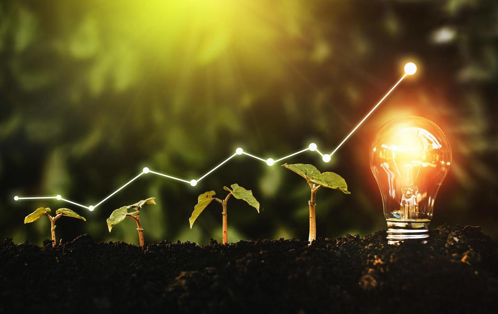

+++
title = "Lebensenergie & ATP"
date = "2021-06-22"
draft = false
pinned = false
tags = ["Biologie"]
image = "900_human-body-2-.jpg"
+++
ATP (Adenosintriphosphat) Ist ein Hydrotrop, das die meisten Zellen verarbeiten, produzieren und als Kurzzeit Energie-Speicher für chemische Energie benutzen. ATP ist fundamental für unseren Körper. Menschen produzieren jeden Tag etwa ihr eigenes Körpergewicht in ATP. Jedes Lebewesen, das wir kennen benutzt ATP oder etwas sehr Ähnliches. Die ersten Zellen benutzten schon ATP vor der Photosynthese.

Eines der grössten Hindernisse von den ersten Zellen war es, brauchbare Energie zu bekommen. Als Photosynthese entdeckt wurde, begannen viele Zellen die elektromagnetische Energie von der Sonne in chemische Energie, die sie in ATP speichern und nutzen konnten. Aber ein paar Zellen wollten keine Photosynthese machen, also begangen sie andere Zellen zu essen, um ihr ATP zu bekommen. Ein paar Millionen Jahre ging das so weiter, bis eine Zelle die andere ass aber sie nicht umbrachte. Und sie wurden eine Zelle. Die innere Zelle konnte sich jetzt ganz auf Energie produzieren konzentrieren (die ersten Mitochondrien). Und die äussere Zelle konnte sich auf das Überleben konzentrieren. Diese Zelle wurde zum Vorfahren von allem Leben auf unserer Erde. Sie hatte mehr Energie als alle anderen. und wurde der erste Baustein der Evolution des Menschen. Der Körper eines Menschen hat 37,2 Billionen Zellen das ist 3-mal so viel wie alle Bäume und Menschen
auf dieser Welt zusammen.

Quellen  

https://de.wikipedia.org/wiki/ATP 

https://www.pnas.org/content/108/34/14121

https://www.khanacademy.org/science/high-school-biology/hs-biology-foundations/hs-biology-and-the-scientific-method/a/what-is-life

https://www.nature.com/scitable/topicpage/what-is-a-cell-14023083/