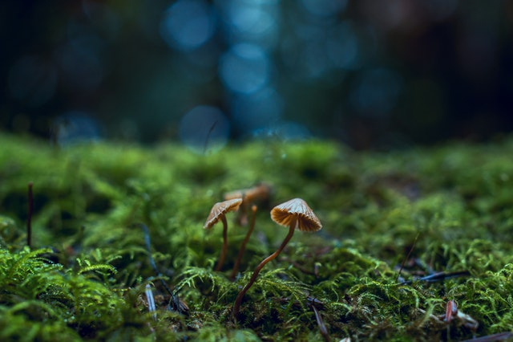

+++
title = "Pilze"
date = "2021-12-01"
draft = false
pinned = false
tags = ["Biologie"]
image = "pexels-pixabay-45205.jpg"
footnotes = "Quellen\n\n<https://de.wikipedia.org/wiki/Pilze>\n\n<https://de.wikipedia.org/wiki/Hefe>\n\n<https://de.wikipedia.org/wiki/Reinzuchthefe>\n\n<https://www.youtube.com/watch?v=m4DUZhnNo4s>\n\nDanke für das Lesen"
+++
Pilze sind aus vielen Gründen sehr interessante Organismen. Sie werden auf der ganzen Welt aktiv erforscht, weil wir noch sehr wenig über Pilze wissen. Wissenschaftler schätzten, dass es auf der Welt über 2.2 Millionen Pilze gibt und 5.1 Millionen Pilzarten. Es wurden schon über 100,000 Arten entdeckt, davon sind 614 essbar. Pilze haben auch eine der wichtigsten Aufgaben in der Nahrungskette. "Sie leben von dem Tod". Pilze verarbeiten alles was tot ist zurück zu Nährstoffen für neues Leben. Und sie vollenden somit der endlose Zyklus des Lebens.

- - -

Wir Menschen sind abhängig von Pilzen. Aber nicht einmal von essbaren, Wir brauchen Pize für einen Grosssteil unserer Rezepte, denn Hefe ist nichts anderes als mikroskopische Pilze, die Nährstoffe umwandeln, so dass wir unser Brot, Orangensaft, Käse, und Bier geniessen können. Anders als Pflanzenzellwände, die aus Zellulose gemacht sind, werden Pilzzellwände von Chitin gestärkt. Ein Stoff den man in den Exoskeletten von Insekten findet. Dies ist einer der Gründe warum Pilze nicht als Pflanzen eingestuft werden. Man kann alle Pilzarten in 4 grobe Kategorien aufteilen. Die Zersetzer, die Mutualisten, die Raubpilze, und die Parasiten. Zersetzter benutzen Enzyme, um Nährstoffen von nicht lebendigen Organismen zu absorbieren. Die Mutualisten sind eine kleinere Kategorie Pilze die sich an Wurzeln von Pflanzen befestigen und ihnen zu helfen mehr Rohstoffe aus dem Boden zu holen. Als Gegenleistung versorgt die Pflanze den Pilz mit Energie. Raubpilze sind Pilze, die andere lebende Organismen jagen und töten. Und dann gibt es noch Parasitenpilze, die sich von Organismen ernähren, ohne sie zu töten. Gewisse Parasitenpilze können sogar das Gehirn des Gastgebers invadieren, um volle Kontrolle über den Körper zu haben.