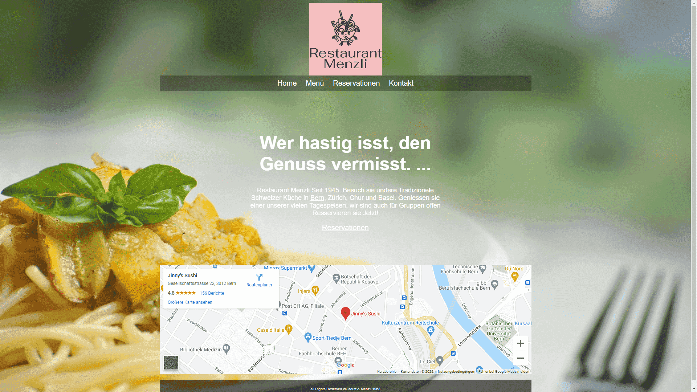
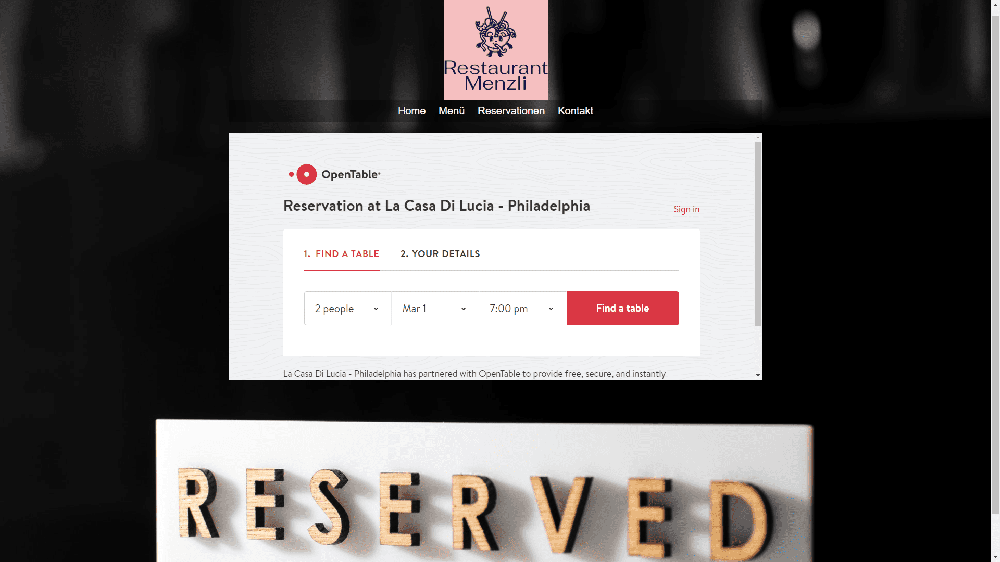

+++
title = "Programmieren"
date = "2022-03-01"
draft = false
pinned = false
image = "visual-studio-code-01.03.2022-10_10_22.png"
+++
Ich habe mich letzte Woche ein wenig mit Visual Studio Code befasst. Dabei hatte ich eine menge Spass und konnte eine kleine Website aufbauen. Mich hat Programmieren schon immer interessiert, ich finde es spannend wie vieles simples etwas komplexes machen kann. Es gibt mehrere Programmiersprachen wie zum Beispiel Java, Python oder CSS Ich verwende hauptsächlich HTML (Hypertext Markup Language). Bis jetzt habe ich noch nicht viel gemacht aber ich habe schon eine "Test Website" für ein Restaurant das nicht existiert.

- - -

Ich habe diese Website als Übung gemacht und habe sehr viel gelernt. Ganz oben ist das Logo das ich entwickelt habe und darunter eine Navigation Zeile. Die Website besteht im ganzen aus 4 Seiten Home, Menü, Reservierungen und Kontakt. Unter diesen ist auch noch ein kurzer Text über die Geschichte und Angebote des Restaurants. Ich habe auf der Titelseite auch mit Google Maps verbunden so das man die Ortschaft in einem Blick erfassen kann.

- - -

Bei dieser Seite habe ich ein Menü aus einem amerikanischen Hotel verwendet und dies ein bisschen um editiert. Dabei habe ich auch ein gedeckter Tisch als Hintergrund genommen.

- - -

Diese Seite habe ich mit Open Table verbunden so dass man auf der Website Live Reservationen machen kann bis zu 20 Personen. Ich habe dann zusammen mit dem dunklen Hintergrund auch noch ein "Reserviert" Zeichen hinzugefügt.