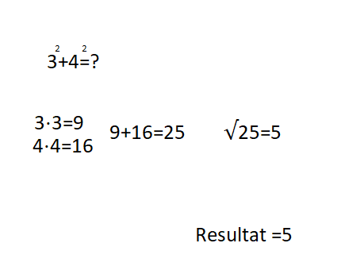

+++
title = "Satz des Pythagoras"
date = "2020-08-27"
draft = false
pinned = false
image = "260px-01-rechtwinkliges_dreieck-pythagoras.svg.jpg"
+++
**Der Satz des Pythagoras**

Der Satz des Pythagoras ist eine mathematische Formel. So simpel wie 

damit berechnet man C eines rechteckiges Dreieckes. ich werde alles mit einem Beispiel erklären

Beispiel:

Das in der Mitte ist unser Dreieck a ist 3 b ist 4 wir dürfen aber nicht Vergessen das hoch 2 muss sein der schritt 1 ist beides mal sich selber zu rechnen also 3⋅3=9 4⋅4=16 dann muss (schritt 2) man 9+16 machen. In diesem Fall gibt es 25 schritt 3 ist es die Wurzel vom Resultat (25) ziehen = 5 und da ist das Resultat

