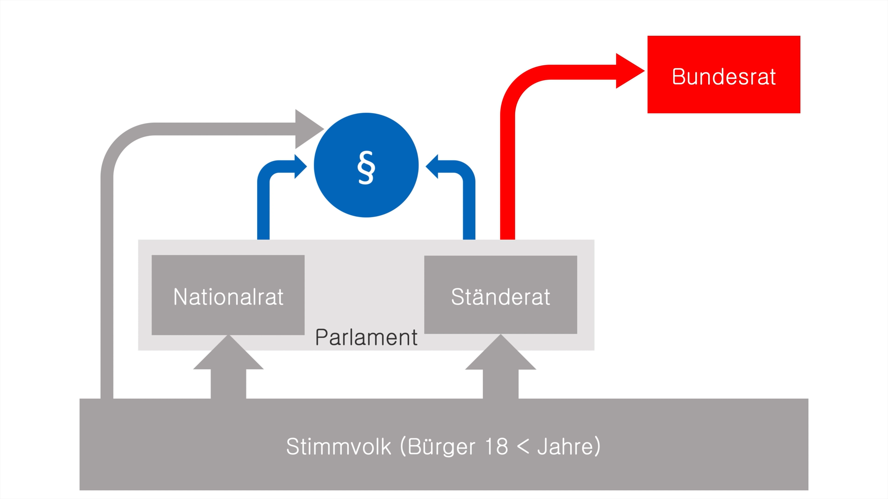

+++
title = "Schweizer Politik"
date = "2020-10-29"
draft = false
pinned = false
image = "download-2-.png"
description = ""
footnotes = "Links\nhttps://www.youtube.com/watch?v=qjQHcphS0lY&t=202s\nhttps://de.wikipedia.org/wiki/Bundespr%C3%A4sident*(Schweiz)\nhttps://de.wikipedia.org/wiki/Grundrechte*(Schweiz)\nhttps://www.youtube.com/watch?v=dQw4w9WgXcQ\nhttps://de.wikipedia.org/wiki/Bundeskanzler_(Schweiz)"
+++
Um die Schweizer Politik zu verstehen muss man wissen welche arten von Demokratie es gibt.\
Es gibt  Repräsentative Demokratie  und  Direkte Demokratie. Die Schweizer Politik ist eine Mischung zwischen Beiden. in Europa besitzt kein Land eine 100%  Direkte Demokratie.
Die Schweiz ist das Land das diesem Konzept am Näherstehen kommt mit einer halbdirekten Demokratie.

Bei der Direkten Demokratie kann das Volk selber über gesetzte entscheiden und es gibt kein Parlament.

Bei der Repräsentativer Demokratie wählt das Volk nur seine Vertreter die dann über Gesetze entscheiden können und haben somit keinen direkten Einfluss auf das Parlament

Die Schweiz hat Elemente von beiden Demokratien was dem Volk erlaubt selber zu entscheiden aber es gibt trotzdem ein Parlament. 

Das Schweizer Stimmvolk (Bürger über 18 Jahre) wählen das Parlament. Das Parlament besteht aus dem Nationalrat Und dem Ständerat. Das Parlament Macht Gesetze und schlägt Änderungen in der Verfassung vor. über diese Änderungen muss das Volk zwingend abstimmen man nennt dies obligatorisches Referendums recht. Das Parlament wählt auch den Bundesrat der aus 7 Politikern besteht

Wen das Parlament eine Änderung in der Verfassung vornehmen will dann muss das Volk zwingend abstimmen (oben erwähnt). Die Änderung wird nur dann angenommen wenn die Mehrheit der Bevölkerung und der Kantone dafür stimmen.  Das nennt sich dass Volks und Ständemehr. Das Ständemehr dient dafür so das bevölkerungs- starke Kantone wie Zürich politische Entscheidungen nicht zu stark beeinflussen.

Will das Volk eine Änderung vornehmen nennt sich das Initiative. Für eine Initiative müssen 100,000 unterschritten gesammelt Verden. Gelingt dies wir abgestimmt für eine Initiative wird Volk und Ständemehr benötigt.

Wenn das Parlament ein neues gesetzt erlässt muss das Volk nicht zwingend abstimmen ist das Volk jedoch nicht zufrieden müssen 50,000 Unterschrift gesammelt werden dann wird nochmal abgestumpft. das ist das fakultatives Referendums recht. es wird nur das volks- mehr benötigt das Ständemehr spielt hierbei keine rolle.  

Gewaltenverteilung\
Um zu verhindern das eine Person zu viel Mach besitzt gibt es die Gewaltenteilung. Man unterscheidet die vollenden 3 Gewalten 

Die Legislative (das Parlament)
(Gesetzgebende Gewalt)      

Abgesehen vom Volk ist die legislative die höchste Gewalt in der Schweiz Sie bestimmt gesetzte und Versfassung Änderungen. Sie besteht aus zwei gleichgestellten Räten. Den Nationalrat und den Ständerat. Der Nationalrat repräsentiert das Volk wird alle 4 Jahre neu gewählt und besteht aus 200 Mitglieder. Der Ständerat repräsentiert die Kantone jeder Kanton hat 2 Mitglieder jeder halb Kanton (Unterwalden Appenzell Basel Schwyz Glarus) 1 Mitglied  im Ständerat somit hat der Ständerat 46 Mitglieder

Die Exekutive(der Bundesrat)

Der Bundesrat besteht aus 7 Mitglieder die vom Parlament gewählt werden. Ihre ahmt zeit beträgt 4 Jahre. Obwohl es ein Bundespräsident gibt sind alle Mitglieder gleichgestellt das nennt sich Kollegialität Regierung. Der Bundespräsident Repräsentiert den Bundesrat nach aussen Er wird von der Bundesversammlung jedes Jahr neu gewählt. zu dem steht jedem Mitglied ein Departement zu. Der Bundeskanzler unterstützt und beratet den Bundesrat ist aber selber kein Mitglied des Rates

1. Das Eidgenössische Departement für auswärtige Angelegenheiten
2. Eidgenössische Departement des Innern
3. Justiz und Polizei Departement
4. Verteidigung Bevölkerungsschutz und Sport
5. Finanz Departement
6. Wirtschaft Bildung und Forschung
7. Umwelt verkehr und Kommunikation

Die Judikative
in der Schweiz ist das Bundesgericht das höchste Gericht. Es überwacht die Einhaltung der gesetzte und regeln. Kann eine Angelegenheit nicht im Kanton geregelt werden entscheidet das Bundesgericht. Die 4 Bundesrichter werden bei der Bundesversammlung gewählt ihre Amts Dauer beträgt 6 Jahre

Föderalismus
Unter Föderalismus Versteht man die Verteilung der Verantwortung der Schweiz auf die Kantone. Damit Hat jeder Kanton seine eigene Legislative, Exekutive und Judikative. So kann jeder Kanton Gesetzte Machen Erlassen und ausführen.

Die Verfassung
Die Verfassung ist das Regeln Buch der Schweiz das am absolut höchsten steht es bei-innhaltet regeln die zu beachten sind bei den Wahlen oder beim Militär oder wen man den Müll raus bringt. Die einzige Ausnahme ist das zwingende Völkerrecht (Gegen Sklaverei und Folter)