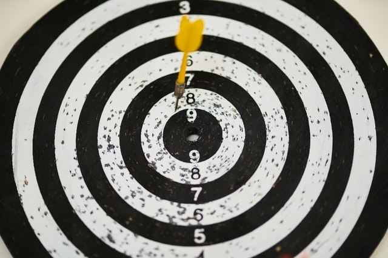

+++
title = "Ziele"
date = "2021-08-23"
draft = true
pinned = false
tags = []
image = "aeschbacher-ziele-1.jpg"
+++
Ich habe mir vorgenommen dieses Jahr meine ziele in einem Blog zu notieren um in Zukunft Meine vorschritte zu sehen und mein grösstes ziel dieses Jahr ist es eine Lehrstelle als Bibliothekar zu finden. ich wünsche mir schon lange in einer Bibliothek zu arbeiten. im Moment sind 4 Lehrstellen offen ich habe mich aber noch nicht beworben. Meine zweites ziel ist es das meine eigene Bibliothek in lauf kommt. Und da "in lauf kommen" kein festes ziel ist mache ich es zu meinem ziel 100 Bücher zu eintragen. Und genau so viele auszuleihen. Als 3 ziel nehme ich mir vor wöchentlich zu in meinem Lernblog zu posten. Ich kann es kaum erwarten zu sehen wie weit ich in einem Jahr bin.

